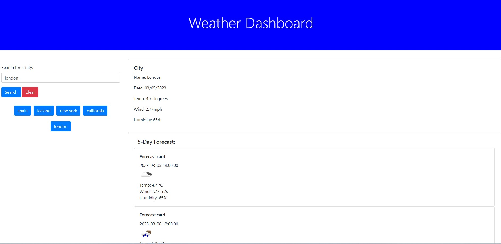

# Weather-Dashboard

## Description 
    
    
This application will take the city you search for and return key information using the OpenWeather Api,including a 5 day forecast. 

    
## Installation 
    
    
There is no installation required, simply run the deployed github page. 

    
## Useage 
    
    
This application is for any person to check the weather forecast of a city. 

    
## License 
    
    
This application is covered under the MIT license

    
## Contributing 
    
    
To contribute to this application, contact me on tomward@gmail.com

    

    
## Questions 
    
    
If you have any questions, feel free to contact me on tomward@gmail.com